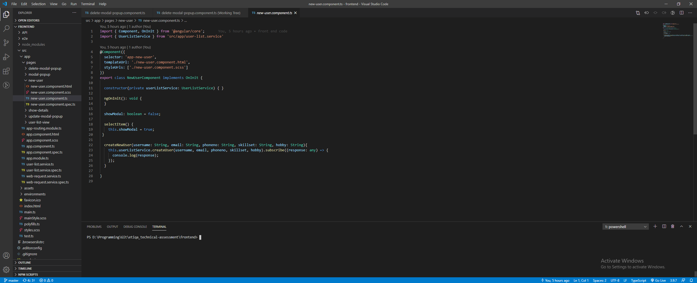
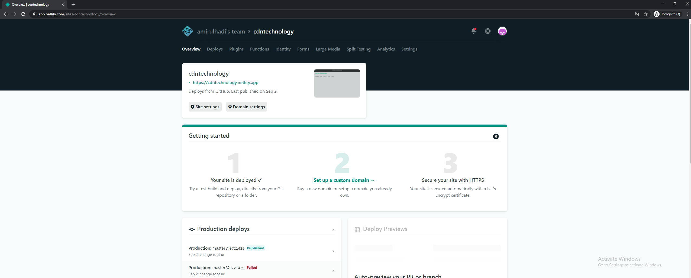

# Complete Developer Network (CDN) - Frontend
Simple app created with Angular and integrate with Node.js, and PostgreSql
Can refer to https://github.com/amirulhadi/API-cdn for the API

## Table of contents
* [General info](#general-info)
* [Technologies](#technologies)
* [Setup](#setup)
* [Demo](#demo)

## General Info
This project is a a fictional company, CDN - Complete Developer Network is going to build a list of freelancers.
such that they could have a directory of contact get people for their job. The frontend will capture, post and retrieve the data from backend

## Technologies
Project is created with:
* Angular 

## Setup
### Front-End
Implement the front-end development using Angular Framework 
SCSS by using Bulma CSS Framework
## Development server

Run `ng serve` for a dev server. Navigate to `http://localhost:4200/`. The app will automatically reload if you change any of the source files.

## Code scaffolding

Run `ng generate component component-name` to generate a new component. You can also use `ng generate directive|pipe|service|class|guard|interface|enum|module`.

## Build

Run `ng build` to build the project. The build artifacts will be stored in the `dist/` directory. Use the `--prod` flag for a production build.



### Hosted
- Frontend code is hosted in Netlify
- Changing the root url to connect with the api backend
  ```
  this.ROOT_URL = 'https://ccomplete-developer-network.herokuapp.com';
  ```


## Demo
https://cdntechnology.netlify.app/userList


